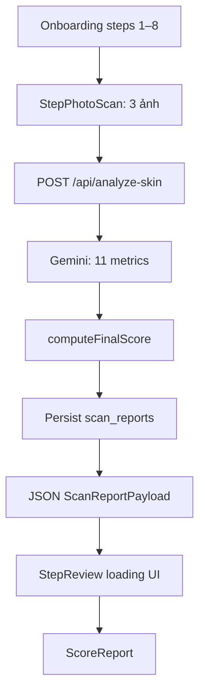

# Skincare AI Consultant — Design Document

> Tài liệu thiết kế kỹ thuật suy ra từ source code hiện tại và `SPEC.md`.  
> **Trọng tâm:** Skin Health Report (§8). Cập nhật: 2026-05-22.

---

## Mục lục

1. [Tổng quan hệ thống](#1-tổng-quan-hệ-thống)
2. [Kiến trúc ứng dụng](#2-kiến-trúc-ứng-dụng)
3. [Pipeline dữ liệu → Report](#3-pipeline-dữ-liệu--report)
4. [Skin Health Report — Thiết kế chi tiết](#4-skin-health-report--thiết-kế-chi-tiết)
5. [Liquid Glass UI](#5-liquid-glass-ui)
6. [Scoring Engine & AI Metrics](#6-scoring-engine--ai-metrics)
7. [Personalization Layer](#7-personalization-layer)
8. [API & Persistence](#8-api--persistence)
9. [Gap so với SPEC](#9-gap-so-với-spec)
10. [Hướng phát triển](#10-hướng-phát-triển)

---

## 1. Tổng quan hệ thống

**Skincare AI Consultant** là web app Next.js (App Router) cho phép người dùng:

1. Hoàn thành **onboarding** (mục tiêu, lifestyle, ảnh da).
2. Gửi **3 ảnh khuôn mặt** (front / left-45 / right-45) lên Gemini.
3. Nhận **Skin Health Report** với điểm 0–100, 9 chỉ số chi tiết, phân tích lifestyle.
4. (Tương lai) Xem **routine cá nhân hóa** và affiliate products.

| Layer | Công nghệ |
|-------|-----------|
| Framework | Next.js 15+, App Router, React Server/Client Components |
| Styling | Tailwind CSS 4, design tokens trong `globals.css` |
| Animation | Framer Motion (spring `stiffness: 220`, `damping: 26`) |
| AI | Google Generative AI (Gemini 2.5 Flash) |
| Database | Supabase (`leads`, `scan_reports`, `products`, …) |
| Validation | Zod (`aiMetricsSchema`, scoring types) |

**Đối tượng UX:** Gen Z Việt Nam, mobile-first, shell onboarding `max-w-[480px]`.

---

## 2. Kiến trúc ứng dụng

### 2.1 Cấu trúc thư mục (liên quan Report)

```text
src/
├── app/
│   ├── api/analyze-skin/route.ts    # Triple-image + legacy single-image
│   └── onboarding/page.tsx          # Orchestrator: form → scan → StepReview
├── components/
│   ├── report/                      # ★ Toàn bộ UI Report
│   │   ├── score-report.tsx         # Shell §8
│   │   ├── hero-section.tsx         # §8.1
│   │   ├── score-gauge.tsx
│   │   ├── metrics-grid.tsx         # §8.3
│   │   ├── metric-card.tsx
│   │   ├── lifestyle-impact-section.tsx  # §8.4
│   │   ├── routine-cta.tsx          # §8.6.4 (placeholder)
│   │   ├── glass-card.tsx
│   │   ├── insight-bubble.tsx
│   │   ├── insights.ts              # Pure personalization logic
│   │   └── types.ts                 # ScanReportPayload, REPORT_SPRING
│   └── onboarding/
│       └── step-review.tsx          # Loading / error / ScoreReport
├── lib/
│   ├── scoring/engine.ts            # Composite + lifestyle + bands
│   ├── gemini/analyze-skin-metrics.ts
│   └── hooks/use-low-power.ts       # Fallback GPU (chưa wired vào report)
└── types/skin-analysis.ts           # Re-export legacy analysis type
```

### 2.2 Luồng người dùng (onboarding → report)



**Entry point UI:** `src/app/onboarding/page.tsx` — bước cuối `review` render `StepReview`, khi có `analysisResult` thì mount `ScoreReport`.

---

## 3. Pipeline dữ liệu → Report

### 3.1 Request (client)

`runAnalysis()` trong `onboarding/page.tsx` gửi:

```json
{
  "images": [{ "mimeType": "image/jpeg", "data": "<base64>" }, ...],
  "onboarding": {
    "user_name", "primary_goals", "skin_type_self_reported",
    "location", "habits": { "sleep_hours", "water_liters", "diet", "age_range", "environment", ... }
  }
}
```

Ảnh được nén trước (`compressImage`, max 2048px, quality 0.9). Loading tối thiểu **4 giây** (`MIN_ANALYZING_MS`) để hiển thị labor-illusion phrases.

### 3.2 Server (`handleTripleScan`)

1. **`analyzeSkinMetrics(images, ctx)`** — Gemini trả về `AiMetrics` (Zod-validated).
2. **`buildScoringOnboarding(raw)`** — map FormData → SPEC vocabulary (`AgeGroup`, `SleepBand`, …).
3. **`computeFinalScore(metrics, onboarding)`** — composite + modifiers ±20 + band.
4. **Insert `scan_reports`** (fire-and-forget; lỗi DB không chặn response).
5. **Response** khớp `ScanReportPayload` trong `components/report/types.ts`.

### 3.3 Biến CSS toàn report

`ScoreReport` set một biến duy nhất trên root:

```css
--score-color: <hex từ score_band.color>
```

Mọi thành phần con (gauge, halo hero, CTA gradient) đọc `var(--score-color)` — không cần prop-drill màu hex.

### 3.4 Context personalization

`StepReview` build `ReportContext` **một lần** tại boundary:

| Field | Nguồn |
|-------|--------|
| `userName` | `data.user_name` |
| `goalLabel` | `GOAL_LABELS[primary_goals[0]]` |
| `ageId` / `ageLabel` | `step-age` helpers |
| `location` | `lifestyle.location` |
| `workEnvId` / `workEnvLabel` | `step-environment` |
| `dietIds` / `dietLabels` | `step-diet` |
| `waterLiters`, `sleepHours` | `lifestyle` |

Deep children (`HeroSection`, `MetricsGrid`, `LifestyleImpactSection`) chỉ nhận `ctx: ReportContext`.

---

## 4. Skin Health Report — Thiết kế chi tiết

### 4.1 Component tree

```text
ScoreReport (root: --score-color)
├── HeroSection          §8.1
│   └── GlassCard
│       └── ScoreGauge
├── MetricsGrid          §8.3
│   └── MetricCard × 9
│       └── InsightBubble? (optional)
├── LifestyleImpactSection  §8.4
│   ├── GlassCard × N (modifiers)
│   └── CauseEffectsBlock → InsightBubble
├── RoutineCta           §8.6.4 (stub)
├── Disclaimer (motion.p)
└── Retry button
```

**Orchestrator:** `src/components/report/score-report.tsx`

### 4.2 Section mapping: SPEC §8 vs Implementation

| SPEC §8 | Mô tả SPEC | Trạng thái code | Component |
|---------|------------|-----------------|-----------|
| **8.1** Hero | Greeting, gauge, band, skin type, percentile | ✅ Một phần | `hero-section.tsx`, `score-gauge.tsx` |
| **8.2** Heatmap / Face map | 9 vùng SVG, bảng zone | ❌ Chưa có | — |
| **8.3** Chi tiết chỉ số | 7+ cards hydration/acne/… | ✅ 9 metrics | `metrics-grid.tsx`, `metric-card.tsx` |
| **8.4** Lifestyle impact | Sleep, diet, UV, potential score | ✅ Một phần | `lifestyle-impact-section.tsx` |
| **8.5** Flags | Red flags, ingredient, age | ⚠️ Chỉ trong modifier `is_red_flag` | Badge trên modifier card |
| **8.6** Routine preview | AM/PM/weekly + CTA | ⚠️ CTA placeholder | `routine-cta.tsx` |
| **8.7** Progress tracking | Rescan, timeline | ❌ Chưa có | Nút "Scan lại" only |

### 4.3 §8.1 Hero Section

**File:** `hero-section.tsx`

| Sub (SPEC) | Hành vi hiện tại |
|------------|------------------|
| Greeting | Headline động: nếu có `goalLabel` → *"Mục tiêu {goal} của {name} đang hoàn thành {score}%"*; không thì *"Skin Report của {name} — điểm hiện tại {score}/100"* |
| Overall score | `ScoreGauge` — SVG ring, số đếm sync với `useMotionValue` |
| Score label | Badge màu `var(--score-color)` + emoji từ `score_band` |
| Skin type | Badge phụ từ self-report (`getSkinTypeLabel`) |
| Percentile | Không implement (Phase 2) |
| Context box | Câu *"Mika phân tích dựa trên bối cảnh: …"* từ age/location/work env |

**Adaptive tint:** `GlassCard` nhận `tint` = `color-mix(in srgb, var(--score-color) 12%, …)` + halo `radial-gradient` phía sau gauge.

### 4.4 §8.3 Metrics Grid

**File:** `metrics-grid.tsx`

Hiển thị **9 chỉ số** từ `composite_breakdown` (đã direction-correct, **100 = tốt**):

| Key | Label VN | Ghi chú |
|-----|----------|---------|
| `hydration` | Cấp ẩm | Trực tiếp từ AI |
| `acne` | Tình trạng mụn | Sub-score engine; subtitle = đếm mild/moderate/severe |
| `sebum` | Cân bằng dầu | Optimal ~50 trên thang AI |
| `pore` | Lỗ chân lông | `100 - pore_raw` |
| `wrinkle` | Nếp nhăn | `100 - wrinkle_raw` |
| `pigmentation` | Sắc tố / thâm | `100 - pigmentation_raw` |
| `skin_tone_evenness` | Đều màu da | Trực tiếp |
| `redness` | Da nhạy cảm / đỏ | `100 - redness_raw` |
| `texture` | Bề mặt da | Trực tiếp |

**Quan trọng:** UI **không** bind `ai_metrics` thô — tránh hiển thị pigmentation cao = bar xanh (sai hướng).

**Layout:** CSS grid `grid-cols-2 gap-3`. Mỗi `MetricCard`:

- Icon + số điểm màu theo `getScoreBand(score)` **của từng metric** (khác band tổng).
- Progress bar animate width với stagger `delay: 0.08 + index * 0.04`.
- `InsightBubble` optional từ `getMetricInsight()`.

### 4.5 §8.4 Lifestyle Impact

**File:** `lifestyle-impact-section.tsx`

**Nhánh A — Engine modifiers (`lifestyle_modifiers[]`):**

- Mỗi item: icon theo `factor`, điểm ±, `message`, chip `metric_affected`.
- Tint card: xanh (positive) / đỏ (negative).
- `is_red_flag` → badge "🚩 Red flag" (ví dụ: không SPF + age ≥ 25).
- Header hiển thị tổng `modifier_total.applied`.
- Nếu `raw !== applied` → footnote cap ±20.

**Nhánh B — Cause & Effect (`buildCauseEffects`):**

- Không phải điểm modifier; là câu nối thói quen ↔ chỉ số (nước → hydration, diet → sebum).
- Subsection *"Thói quen đang tạo nên các chỉ số"*.

**Chưa có:** §8.4.5 **Potential Score** projection (`modifier_total.raw` có trong payload nhưng UI chưa render câu *"Da bạn có thể đạt X điểm nếu…"*).

### 4.6 §8.6 Routine CTA

**File:** `routine-cta.tsx`

- Gradient nút theo `--score-color`, shimmer top border.
- `onClick` → `alert("Tính năng Routine đang phát triển!")`.
- `recommended_routine` trong DB luôn `null`.

### 4.7 Loading & Error (StepReview)

Trước khi có `result`, `step-review.tsx` render:

- **Loading:** preview ảnh + grid overlay + laser scan animation + rotating phrases (location/sleep/water/goal-aware).
- **Error:** glass card + nút Thử lại → `onRetry` quay về bước photo.

---

## 5. Liquid Glass UI

### 5.1 Nguyên tắc (SPEC §2.1)

| Nguyên tắc | Triển khai trong code |
|------------|----------------------|
| Translucency | `backdrop-filter: blur(24px) saturate(180%)` trên `GlassCard` |
| Soft light | `inset 0 1px 0 rgba(255,255,255,0.5)` + outer shadow |
| Adaptive tint | Prop `tint` trên `GlassCard`; hero dùng `--score-color` |
| Fluid motion | `REPORT_SPRING` shared: `{ type: 'spring', stiffness: 220, damping: 26 }` |

### 5.2 `GlassCard` vs `InsightBubble`

| Surface | Blur | Vai trò |
|---------|------|---------|
| `GlassCard` | 24px / 180% | Card chính |
| `InsightBubble` | 20px / 160% | Sub-layer trong card |
| Disclaimer / Retry | 20px inline style | Footer actions |

`GlassCard` **không** tự animate — caller wrap `motion.div` khi cần stagger.

### 5.3 Score band colors (§7.C / §2.3)

| Band ID | Range | Color | Label VN |
|---------|-------|-------|----------|
| `critical` | 0–39 | `#E74C3C` | Cần cải thiện gấp |
| `poor` | 40–59 | `#E67E22` | Cần cải thiện |
| `fair` | 60–74 | `#F1C40F` | Khá ổn |
| `good` | 75–89 | `#2ECC71` | Tốt |
| `excellent` | 90–100 | `#3498DB` | Xuất sắc |

### 5.4 Performance fallback

`use-low-power.ts` detect `prefers-reduced-motion` + `max-width: 640px` — **chưa được import** trong report components. SPEC §2.4 yêu cầu giảm backdrop-filter trên thiết bị yếu; đây là gap triển khai.

---

## 6. Scoring Engine & AI Metrics

### 6.1 Pipeline (engine.ts)

```text
AiMetrics (Gemini, §6.B)
    → computeCompositeBreakdown()   # 9 sub-scores, direction-corrected
    → computeCompositeScore()       # weighted sum (weights sum = 100%)
    → computeLifestyleModifiers()   # independent rules
    → capModifierTotal()            # clamp ±20
    → final = round(clamp(composite + capped, 0, 100))
    → getScoreBand(final)
```

### 6.2 Trọng số composite (§7.A)

| Metric | Weight |
|--------|--------|
| acne | 20% |
| hydration | 15% |
| pigmentation | 12% |
| sebum | 10% |
| wrinkle | 10% |
| skin_tone_evenness | 10% |
| pore | 8% |
| redness | 8% |
| texture | 7% |

**Ngoài composite:** `dark_circles`, `blackheads`, `sagging` — có trong `AiMetrics` nhưng không vào điểm tổng v1.

### 6.3 Acne sub-score

```text
acne_score = clamp(100 - (severe×10 + moderate×5 + mild×2), 0, 100)
```

Report hiển thị raw counts dưới card acne qua `acneSubtitle()`.

### 6.4 Lifestyle modifiers (mẫu)

| Factor | Điều kiện | Value | Red flag |
|--------|-----------|-------|----------|
| sleep | `<6h` bands | −5 | |
| sleep | `7-8h` | +3 | |
| water | `<1.5L` | −5 | |
| diet | sweet/spicy/fatty | −5 | |
| diet | healthy | +5 | |
| stress | 4–5 | −5 | |
| stress | 1–2 | +3 | |
| sunscreen | never + age ≥25 | −8 | ✅ |
| smoking | regularly | −8 | |
| exercise | 3–4+ sessions | +3 | |
| environment | outdoor/polluted | −5 | |

Onboarding hiện tại **chưa thu** đủ field (`uses_sunscreen`, `smokes`, `stress_level`) → nhiều rule không fire.

---

## 7. Personalization Layer

**File:** `src/components/report/insights.ts` — pure functions, không React.

### 7.1 `getMetricInsight(key, score, ctx)`

| Metric | Rule | Tone |
|--------|------|------|
| `hydration` | office + score `<60` | warning |
| `hydration` | office + score `≥80` | praise |
| `wrinkle` | age `18_24` + score `<70` | warning (lão hóa sớm) |
| `wrinkle` | age `45_54`/`55_plus` + score `≥75` | praise (trẻ hơn X tuổi) |
| `pigmentation` | sunny VN city + score `<65` | warning (UV) |

**Location heuristic:** `SUNNY_LOCATION_HINTS` — substring match sau `normalizeVi()` (bỏ dấu).

### 7.2 `buildCauseEffects(ctx, breakdown)`

- Water liters → hydration score (praise/warning theo `≥1.5L`).
- Diet labels → sebum score (negative diet ids: sweet, spicy, fatty).

### 7.3 Mở rộng rule

Thêm branch trong `switch (key)` hoặc push vào `buildCauseEffects` — return `null` / `[]` khi không match để UI không render bubble rỗng.

---

## 8. API & Persistence

### 8.1 `POST /api/analyze-skin`

| Branch | Trigger | Response shape |
|--------|---------|----------------|
| **Triple** | `body.images[]` | `ScanReportPayload` |
| **Legacy** | `body.image` hoặc `multipart` | `{ analysis, recommendedProducts, … }` |

Report UI chỉ dùng **triple branch**.

### 8.2 `ScanReportPayload` (types.ts)

```typescript
{
  scan_report_id: string | null;
  overall_score: number;           // final sau modifier
  composite_score: number;         // trước modifier
  score_band: { id, label, emoji, color, message, cta };
  ai_metrics: AiMetrics;
  composite_breakdown: CompositeBreakdown;
  lifestyle_modifiers: LifestyleModifier[];
  modifier_total: { raw, applied };
  disclaimer: string;              // MEDICAL_DISCLAIMER
}
```

### 8.3 Database: `scan_reports`

| Column | Nội dung |
|--------|----------|
| `ai_metrics` | JSONB — 11 metrics |
| `lifestyle_modifiers` | JSONB array |
| `overall_score` | int 0–100 |
| `score_band` | enum text |
| `recommended_routine` | null (Phase 2) |
| `lead_id` | nullable — onboarding chưa trả `lead_id` về client |

---

## 9. Gap so với SPEC

### 9.1 Report UI

| Hạng mục | SPEC | Hiện trạng |
|----------|------|------------|
| Face heatmap §8.2 | SVG 9 zone | Không có |
| Per-metric deep cards §8.3 | Nguyên nhân, ảnh hưởng, mini face map | Chỉ score bar + 1 insight bubble |
| Potential score §8.4.5 | Motivational projection | Data có (`modifier_total.raw`), UI chưa |
| Flags section §8.5 | Red flags tập trung, ingredient conflicts, age flags | Rải rác trong modifiers |
| Routine §8.6 | AM/PM/weekly preview | Alert placeholder |
| Progress §8.7 | Timeline scan #2+ | Chỉ retry scan |
| Percentile §8.1.5 | So sánh cohort | Phase 2 |
| Low-power fallback §2.4 | Giảm blur | Hook có, chưa dùng |

### 9.2 Onboarding → Scoring

| Field SPEC | Onboarding form | Ảnh hưởng |
|------------|-----------------|------------|
| `uses_sunscreen` | ❌ | Không fire SPF red flag |
| `smokes` | ❌ | Không fire smoking −8 |
| `stress_level` | ❌ | Không fire stress rules |
| `gender` | ❌ | DB column có, chưa thu |
| `lead_id` in analyze request | ❌ | `scan_reports.lead_id` null |

### 9.3 Legacy path

`analyze-skin.ts` (single image) + `matchProducts` vẫn tồn tại cho flow cũ; không liên kết `ScoreReport`.

---

## 10. Hướng phát triển

### 10.1 Ưu tiên ngắn hạn (Report)

1. **Potential Score card** — `overall_score + (raw - applied)` hoặc công thức SPEC, copy motivational.
2. **Wire `useLowPower`** — giảm `backdrop-filter` trên `GlassCard` / hero halo.
3. **Flags panel §8.5** — aggregate `is_red_flag` modifiers + rules từ `ai_metrics` (severe acne, redness cao).
4. **Plumb onboarding gaps** — sunscreen, stress, smoking vào form + `buildScoringOnboarding`.

### 10.2 Trung hạn

1. **Face heatmap §8.2** — cần per-zone scores từ Gemini (schema mở rộng) + SVG component.
2. **Routine engine §9** — thay `RoutineCta` alert bằng route `/routine` + populate `recommended_routine`.
3. **`lead_id`** — trả từ `/api/onboarding`, gửi kèm analyze request.

### 10.3 Dài hạn

1. **Progress tracking §8.7** — query `scan_reports` theo user, diff scores.
2. **Email report §10** — HTML mirror các section đã có trên web.
3. **Percentile §8.1.5** — aggregation cohort trên Supabase.

---

## Phụ lục A — Type reference nhanh

```typescript
// ReportContext (insights.ts)
type ReportContext = {
  userName: string;
  goalLabel: string | null;
  ageId: AgeRangeId | null;
  ageLabel: string | null;
  location: string | null;
  workEnvId: EnvironmentId | null;
  workEnvLabel: string | null;
  dietIds: DietOptionId[];
  dietLabels: string[];
  waterLiters: number | null;
  sleepHours: number | null;
};

// LifestyleModifier (engine.ts)
type LifestyleModifier = {
  factor: string;
  value: number;
  metric_affected: string;
  message: string;
  is_red_flag?: boolean;
};
```

---

## Phụ lục B — File index (Report module)

| File | Trách nhiệm |
|------|-------------|
| `score-report.tsx` | Compose sections, set `--score-color`, disclaimer, retry |
| `hero-section.tsx` | Headline, gauge, badges, context sentence |
| `score-gauge.tsx` | Animated SVG ring + counter |
| `metrics-grid.tsx` | 9-metric grid definition |
| `metric-card.tsx` | Single metric glass card + bar |
| `lifestyle-impact-section.tsx` | Modifiers list + cause-effects |
| `routine-cta.tsx` | Primary CTA stub |
| `glass-card.tsx` | Reusable liquid glass surface |
| `insight-bubble.tsx` | Tone-styled sub-insight |
| `insights.ts` | Personalization pure functions |
| `types.ts` | Payload type + `REPORT_SPRING` |
| `step-review.tsx` | Loading/error wrapper + `ReportContext` builder |

---

*Tài liệu này phản ánh implementation tại thời điểm đọc codebase. Khi thêm feature, cập nhật §9 (Gap) và §10 tương ứng.*
