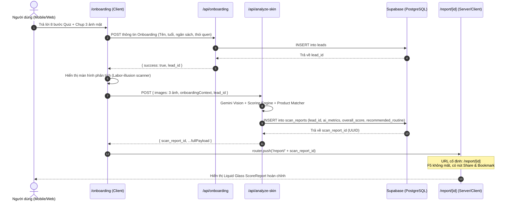

# Kế hoạch Triển khai: Permalink Báo Cáo Soi Da (`/report/[id]`) & Hoàn Thiện Data Flow

## 1. Bối cảnh & Vấn đề hiện tại (Problem Statement)

Hiện tại, ứng dụng gặp 3 điểm nghẽn nghiêm trọng trong luồng trải nghiệm (UX) và dữ liệu (Data Flow):
1. **Mất kết quả khi tải lại trang (No Persistence on Client):** Kết quả soi da chỉ được lưu tạm thời trong React state tại URL `/onboarding`. Nếu người dùng vô tình F5 (reload), vuốt back trên điện thoại hoặc đóng trình duyệt, toàn bộ kết quả biến mất.
2. **Gãy liên kết dữ liệu (Broken Data Flow in DB):** 
   - Khi chụp ảnh xong, hàm `submitOnboarding` lưu thông tin khách hàng vào bảng `leads` theo dạng `fire-and-forget` (không chờ kết quả trả về).
   - API `/api/analyze-skin` không nhận được `lead_id`, dẫn đến việc lưu vào bảng `scan_reports` với `lead_id = NULL`.
   - Trường `recommended_routine` trong `scan_reports` bị bỏ trống (`null`), dù API đã tính toán xong danh sách sản phẩm gợi ý.
3. **Không có khả năng chia sẻ & Retention:** Người dùng không có đường dẫn cố định (`https://domain/report/[uuid]`) để xem lại phác đồ routine khi cần mua sắm trên Shopee, không thể gửi cho bạn bè, và hệ thống không có link để gửi qua Email/Zalo.

---

## 2. Thiết kế Luồng Trải Nghiệm Mới (Target Architecture & User Flow)

---

## 3. Đánh giá tính hợp lý của Flow (Architect & PM Review)

1. **Về mặt Tách biệt trách nhiệm (Separation of Concerns):**
   - Trang `/onboarding` chỉ tập trung vào việc **thu thập dữ liệu đầu vào** (Quiz & Camera).
   - Trang `/report/[id]` chuyên biệt cho việc **trình diễn kết quả (Report & Routine Showcase)**, hỗ trợ SEO metadata động (OpenGraph preview), nút copy link và chia sẻ.
2. **Về mặt Bảo mật & Quyền riêng tư (Security & Privacy):**
   - ID của báo cáo là UUID v4 (122 bits ngẫu nhiên, xác suất đoán trúng gần như bằng 0), đóng vai trò như một unguessable capability URL (giống link Google Docs / Notion chia sẻ bí mật).
   - Trang `/report/[id]` đọc dữ liệu thông qua Server Component với `createAdminClient()`, không cần mở lỏng chính sách RLS `scan_reports` cho public anonymous user.
3. **Về mặt Hiệu năng (Performance):**
   - Khi vừa scan xong: Client đã có sẵn payload trong memory, có thể render ngay lập tức mà không cần fetch lại từ DB.
   - Khi mở lại link cũ từ bên ngoài: Server Component Next.js đọc từ Supabase và render HTML siêu nhanh.

---

## 4. Chi tiết các thay đổi mã nguồn (Proposed Changes)

### Component 1: Data Pipeline & Backend APIs

#### [MODIFY] [route.ts](file:///Users/buiquocvuong/Projects/skincare-ai-consultant/src/app/api/analyze-skin/route.ts)
- Lưu trọn vẹn kết quả sản phẩm gợi ý `recommendedProducts` và `budgetVnd` vào cột `recommended_routine` của bảng `scan_reports`.
- Đảm bảo `parsed.leadId` được gắn chính xác vào row `scan_reports`.

#### [MODIFY] [route.ts](file:///Users/buiquocvuong/Projects/skincare-ai-consultant/src/app/api/onboarding/route.ts)
- Đảm bảo response luôn trả về `{ success: true, lead_id: lead.id }` để client hứng lấy ID.

---

### Component 2: Luồng Chuyển Giao tại Client Onboarding

#### [MODIFY] [page.tsx](file:///Users/buiquocvuong/Projects/skincare-ai-consultant/src/app/onboarding/page.tsx)
- Cập nhật hàm `submitOnboarding` thành async/await để lấy `lead_id` trước hoặc đồng thời với `runAnalysis`.
- Truyền `lead_id` vào body request gọi `/api/analyze-skin`.
- Khi nhận được `scan_report_id`, thực hiện `router.push('/report/' + scan_report_id)` kèm state (hoặc lưu sessionStorage tạm) để trang đích hiển thị tức thì không cần fetch lại.

---

### Component 3: Xây dựng Trang Báo Cáo Cố Định `/report/[id]`

#### [NEW] [page.tsx](file:///Users/buiquocvuong/Projects/skincare-ai-consultant/src/app/report/[id]/page.tsx)
- Route động Next.js Server Component: `src/app/report/[id]/page.tsx`.
- Lấy `scan_reports` theo `id` từ Supabase:
  - Join cùng bảng `leads` (để lấy tên, mục tiêu, độ tuổi, môi trường phục vụ cho `ReportContext`).
  - Nếu không tìm thấy: Render giao diện 404 thân thiện kèm nút quay về `/onboarding`.
  - Nếu tìm thấy: Reconstruct `ScanReportPayload` và `ReportContext`, render component `ReportClientShell`.

#### [NEW] [report-client-shell.tsx](file:///Users/buiquocvuong/Projects/skincare-ai-consultant/src/app/report/[id]/report-client-shell.tsx)
- Wrapper Client Component cho trang báo cáo:
  - Header nổi Liquid Glass hiển thị logo Mika + nút **"Sao chép link" (Copy Share Link)** và badge thông báo "Đã lưu kết quả".
  - Nhúng `ScoreReport` hiện có.
  - Chức năng Web Share API trên điện thoại (chia sẻ nhanh qua Zalo, Messenger, AirDrop).

---

## 5. Kế hoạch Kiểm thử & Xác minh (Verification Plan)

### Kiểm thử Tự động (Automated Verification)
- Chạy Type Checking: `npx tsc --noEmit` để đảm bảo toàn bộ types giữa Supabase DB, API response và ReportContext đồng nhất.
- Chạy Linting: `npm run lint`.

### Kiểm thử Thủ công (Manual Verification Flow)
1. **Kiểm tra luồng Scan mới (Fresh Scan Flow):**
   - Vào `/onboarding`, điền thông tin và quét ảnh.
   - Quan sát xem sau khi quét xong, URL trên thanh địa chỉ có tự chuyển thành `/report/<uuid>` hay không.
   - Kiểm tra Database Supabase xem row mới trong `scan_reports` đã có đủ `lead_id` và `recommended_routine` chưa.
2. **Kiểm tra tính bền vững (Persistence Test - Cốt lõi):**
   - Tại trang `/report/<uuid>`, bấm **F5 (Reload lại trang)**.
   - Xác nhận: Trang tải lại mượt mà, đầy đủ điểm số, phân tích 11 chỉ số và danh sách Routine sản phẩm, không bị văng về trang Onboarding.
3. **Kiểm tra tính năng Chia sẻ (Share & Copy Link):**
   - Bấm nút "Sao chép link".
   - Mở một trình duyệt ẩn danh (Incognito Window) hoặc gửi link sang thiết bị khác.
   - Truy cập vào link đó: Báo cáo vẫn hiển thị chuẩn chỉnh mà không cần đăng nhập.
4. **Kiểm tra trường hợp Link sai (404 Error State):**
   - Gõ một ID rác: `/report/00000000-0000-0000-0000-000000000000`.
   - Xác nhận: Hiển thị màn hình báo cáo không tồn tại tinh tế, có nút điều hướng về trang chủ/soi da mới.
